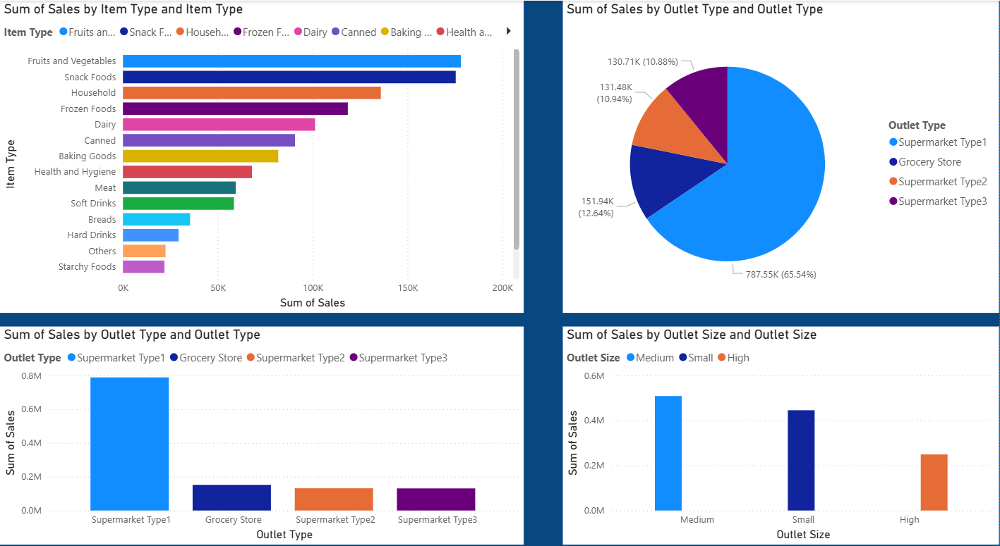

Blinkit Dashboard - Power BI Project

📌 Project Overview

The Blinkit Dashboard is an interactive Power BI project developed to analyze Blinkit's sales performance, outlet distribution, customer preferences, and product category trends. The dashboard transforms raw retail data into meaningful visual insights that help businesses make data-driven decisions.

This project provides a complete overview of sales analysis using dynamic charts, KPIs, and filters for better business understanding and performance tracking.

## 📷 Dashboard Preview

📊 Dashboard Insights

🔹 Sales by Item Type

The dashboard analyzes sales across different product categories such as:

Fruits and Vegetables
Snack Foods
Household Items
Frozen Foods
Dairy Products
Health and Hygiene

Among all categories, Fruits & Vegetables and Snack Foods generate the highest sales.

🔹 Sales by Outlet Type

The dashboard compares sales generated by different outlet types:

Supermarket Type1
Grocery Store
Supermarket Type2
Supermarket Type3

Supermarket Type1 contributes the highest percentage of total sales.

🔹 Sales by Outlet Size

Outlet performance is analyzed based on outlet size:

Medium
Small
High

Medium-sized outlets show the highest sales contribution compared to other outlet sizes.

🎯 Key Features

Interactive Power BI Dashboard
Dynamic Charts & Visualizations
Sales Trend Analysis
Product Category Analysis
Outlet Performance Tracking
KPI Monitoring
Filter and Slicer Support

🛠️ Technologies Used

Microsoft Power BI
Power Query
DAX (Data Analysis Expressions)
Data Modeling
Data Visualization Techniques

📈 Key Performance Indicators (KPIs)

Total Sales
Average Sales
Number of Items Sold
Outlet-wise Sales
Product Category Performance

🚀 Project Workflow

Data Collection
Data Cleaning & Transformation
Data Modeling
Creating Relationships
Building Visualizations
Dashboard Design and Analysis

💡 Conclusion

This Power BI dashboard helps in understanding retail sales performance, customer purchasing behavior, and outlet efficiency. It enables stakeholders to identify profitable product categories and improve business strategies using data visualization and analytics.
